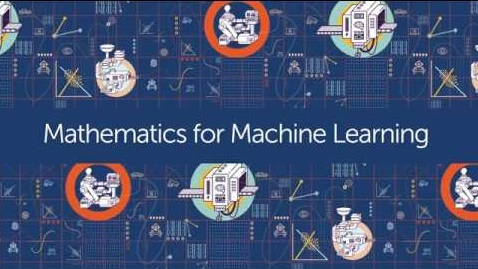

# Mathematics-for-Machine-Learning-Specialization

 

## Coursera Specialization Mathematics for Machine Learning
- Linear Algebra 
- Multivariate Calculus
- PCA

 

## About this Specialization

 

The Goal of this specialization is to give the basics in mathematics for Machine Learning and Data Science. 

In the first course on "Linear Algebra", we look at what linear algebra is and how it relates to data. Then we look through what vectors and matrices are and how to work with them.

The second course, "Multivariate Calculus", builds on this to look at how to optimize fitting functions to get good fits to data. It starts from introductory calculus and then uses the matrices and vectors from the first course to look at data fitting.

The third course, "Dimensionality Reduction with Principal Component Analysis", uses the mathematics from the first two courses to compress high-dimensional data. 

At the end of this specialization you will have gained the prerequisite mathematical knowledge to continue your journey and take more advanced courses in machine learning.

 

## Applied Learning Project

 

Through the assignments of this specialisation you will use the skills you have learned to produce mini-projects with Python on interactive notebooks, an easy to learn tool which will help you apply the knowledge to real world problems. For example, using linear algebra in order to calculate the page rank of a small simulated internet, applying multivariate calculus in order to train your own neural network, performing a non-linear least squares regression to fit a model to a data set, and using principal component analysis to determine the features of the MNIST digits data set.
